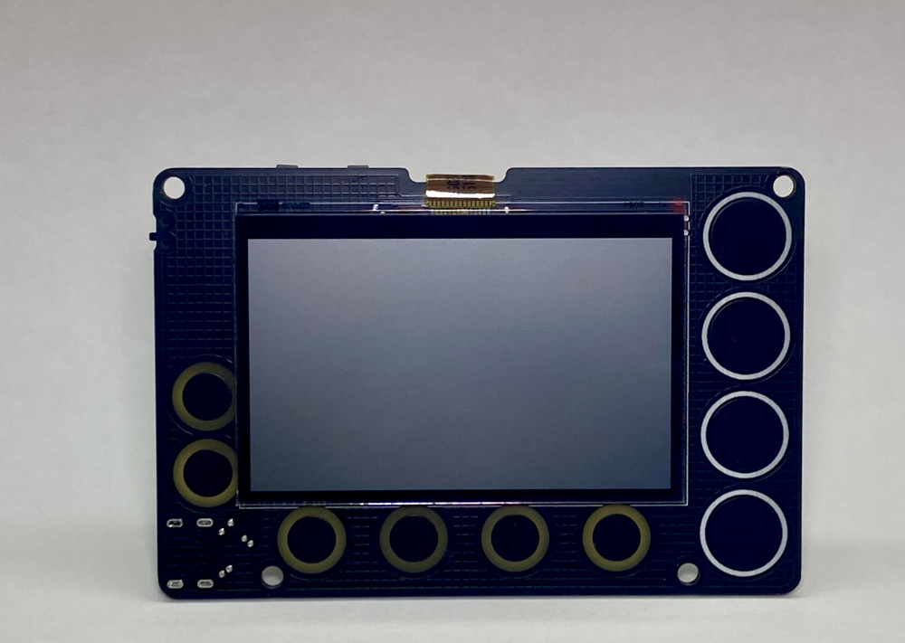
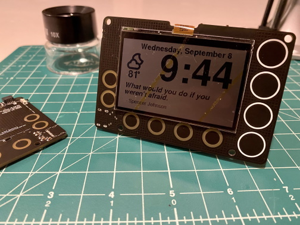

# Newt

The Newt is an always-on, low-powered, mountable display that can be connected to the internet to retrieve weather, calendars, sports scores, todo lists, quotes... really anything that is available on the web! The Newt is powered by an ESP32-S2 microcontroller that can be programmed with Arduino, CircuitPython, and ESP-IDF.

We consider the Newt to be the next evolution of the popular eInk displays that makers love to tinker with. We use a SHARP Memory In Pixel LCD in order to avoid the slow refresh times of eInk. We've added a Real Time Clock to support alarms and timers. Finally, we designed the Newt with battery operation in mind;  every component on the board was chosen for it's ability to operate at low power.

**Lists of product features and/or specifications:**

The Newt is designed to operate for 1-2 months between charges (using a 500 mAH Lipo). The amount of time varies between usage; heavier WiFi usage will more quickly reduce battery charge.

Microcontroller:
- Espressif ESP32-S2-WROVER Module with 4 MB flash and 2 MB PSRAM
- WiFi capable
- Supports Arduino, CircuitPython, and ESP-IDF
- Deep Sleep current as low as 25 uA

Display:
- 2.7 inch 240x400 SHARP Memory In Pixel LCD
- Capable of delivering high-contrast, high-resolution content with ultra-low power consumption
- Reflective mode leverages ambient light to eliminate the need for a backlight

Time Keeping, Timers, and Alarms:
- Micro Crystal RV-3028-C7 Real Time Clock
- Optimized for extreme low power consumption (45 nanoAmps)
- Able to simultaneously manage periodic timer, countdown timer, and alarm
- Hardware interrupt for timers and alarms
- 43 bytes non-volatile user memory, 2 bytes user RAM
- Separate UNIX time counter

Buzzer:
- Speaker/Buzzer with mini class D amplifier on DAC output A0 can play tones or lo-fi audio clips

User Interaction:
- 10 capacitive touch pads
- On/off switch
- Reset and Boot tactile buttons for reprogramming

Power:
- USB Type-C connector for programming, power, and charging
- Low quiescence Voltage Regulator (TOREX XC6220) that can output 1A of current and operate as low as 8 uA.
- JST connector for Lithium-Ion battery
- Battery charging circuity (MCP73831)
- Low Battery indicator (1 uA quiescence current)

PCB and Display dimensions:
- 91 mm x 61mm x 9mm

Software:
- Newt hardware compatible with open-source Arduino libraries for ESP32-S2, Adafruit GFX (fonts), Adafruit Sharp Memory Display (display writing), and RTC RV-3028-C7 (rtc)
- Newt Arduino library and sample programs in progress; will be available on Githib before launch
- Newt CircuitPython libraries and registration on the roadmap (key dependency is the development of CircuitPython library for the RV-3028 real time clock)

Optional Mounting and Desktop Hardware:
- Acrylic Mounting Bracket with magnetic fixtures and expander for "flat" lithium-Ion batteries (up to 2500mAh)
- Putty for non-magnetic adhesion
- Stand for desk or nightstand (made from engineered wood) 
